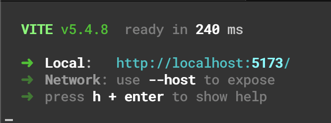

# blog-app

This is a blog app created for Techtonica.

## Installation Instructions

1. Clone the repo on your own command line.
2. Navigate to the server directory and run `npm install` followed by `npm init -y`. Then, create the necessary SQL table by running `psql blogapp < db.sql`. After the database is created, run `npm run start`. The server should begin running on port 5000.
3. Open a new tab in your CLI. Navigate to the client directory. Run `npm install` followed by `npm run dev`. You should see something like this:

Click on the link given next to "host" and the app should display in your browser.
4. To make a new post, click the "create post" button. A form will pop up with text fields to fill out. When you are done entering your post information, click "create post" and your post will appear in the list.

## Project Goals and Requirements
- to do: add titles to posts [x]
- to do: update readme with instructions and visuals [x]
- to do: add comments [x]
- to do: add styling (use tailwind) [x]
- to do: add ai feature
- to do: add required/non required fields to post submission [x]
- to do: add individual post view [x]
- to do: clean up testing from trying to install jest
- to do: add testing to every component
- to do/stretch goal: add ability to add photos to posts
